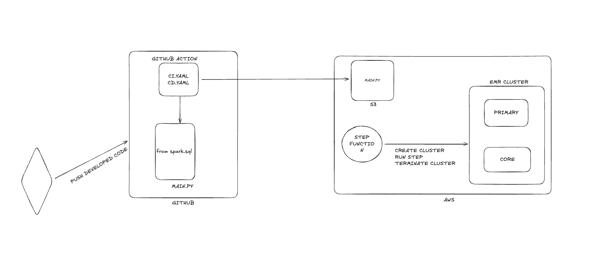

# Spark-platform

For each group, you are to create a VPC, 

In your repository, you would use GitHub as well for CI/CD TO pick python file/spark application from your local and deploy to the cloud (AWS S3)

You will use Step Functions to:
1.	Fetch the python file (which should have now been uploaded in s3).
2.	To create an EMR cluster  
3.	Run Step
4.	Terminate the cluster, after running the application

